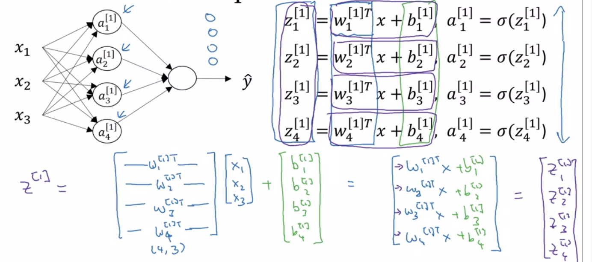

# Week 1

## 1.1 What is a neural network ? 

Housing price prediction:

* bedrooms + size ---> family siz 

* zip code ---> walkability 

* Zip code + wealth ----> school quality

* The stuff after arrows is what the first layer has inferred. 

  

  Combining these inferred feature we can infer price. We do not need to do the above feature engineering. We pass all inputs to all nodes and given sufficient data the nodes will assign weights correctly.

  

  

## 1.2 Supervised learning with Neural Networks:
Examples:

- House price - std nn 

* Ad clicks - std nn

* Photo tagging - convolutional CNN

* Speech recognition -  temporal component -1d sequence data - RNN

* Language translation - alphabets one at a time - RNN

* Autonomous driving - complexity : image, text, radar - Hybrid archi
  

  Structured data :  records of data wherein each feature is well defined. Ex size, bedrooms etc

  Unstructured: Audio, Image, Text . Features might be pixel value [humans are good, tougher for machines]

  

###  1.3 Why is DL taking off 

Scale drives deep learning process. 

* Traditional ML algo, performance improves with amt of data and then stabilizes/plateaus.  

* Over the past 10 years, we have generates a lot of data (arrows in the pic ) -> digitization. Traditional algos cant take adv of it.

* Traditional ML -> small NN -> medium NN -> large NN. NN's can take adv of large data sets. 

* Scale = more data + more units 

  

* Best best at improving NN : through more data, make model larger.

* For smaller training data : the difference in performance between ML, small, medium, large is nearly the same. Not well defined. Performance will depend on features selected etc. 

* Switching from sigmoid (s shape) to relu (flat and positive). Former has regions where the gradient is nearly zero so learning stops. By using relu for activation , gradient is always greater than 0 so GD is faster. 

  

# Week 2 

## 2.1 Logistic Regression as a Neural Network

### 2.1.1 Binary Classification 

Logistic regression = algo for binary classification. 

* Eg cat(1), not cat(0), Image = three separate matrices for Red, Blue, Green. 
* So 1 picture of 64*64 pixels will have 3 matrices of 64*64. 
* How convert to feature vector ? unroll all to 1d matrix X. Total dimensions will 64 * 64*3 = --- 12288 X 1Matrix X - will have m columns where there are m training samples. And n rows wherein the dimensionality of features. 
* The former makes the implementation easier.
  *  X.shape (n x m ). Training samples are stacked as columns not rows. m = no of training samples
  *  Y.shape = (1,m). [ y1, y2, … ym]. 

### 2.1.2 Logistic Regression 

When to use ? Output label in supervised learning is zero or one. 

* Given X, want y^ = P( y = 1| x) , Parameters w , b 

* Linear regression y = wT * x + b 

  * this can be greater than 1 or negative. doesnt make sense for prob. 

  * so we use sigmoid (s shaped curve). Sigmoid(z) = 1 / (1+ e^-z)

  * If z large then sigmoid = 1 / 1+0 = 1 If z large neg then sigmoid = 1/ 1+ big_num = 0 

  * Not using the notation shown on the right wherein b,w are in the same matrix.

     you need a cost function st y^ is nearly same as y. 

* L(y^, y) = ½ ( y^ - y) ^2 -> this is not generally used in log reg because the optimization problem (to find the parameters) is **non-convex** so it has **multiple local optima**. Gradient descent does not work well. 

* We need a convex optimization problem

  *  If y ==1 

    * L = - logy^ 
    * We want loss to be as small as possible ...  so we want log y ^ to be large .... want y^ large 
    * So we want y^  = 1

  * If y==0 

    * L = - log(1-y^) 
    * want L to be small
    * want log (1-y^) to be large 
    * want y^ to small 
    * sigmoid so that means y^ =0 

    Above loss was for one sample. Cost function is over all samples. 1/m summation (L (y, y^)	

    

### 2.1.4 Gradient Descent 

Goal find (w, b) that minimizes the cost function J over all training samples. 

If w is a single row number and b is a single row number then J(w,b) is a surface in 2D space above the two axis and the distance between any point on the surface to w,b is J(w,b) …. We want to find J(w,b) with min distance. **J is a convex function**. U (bowl shaped) . Non convex means many minimas. 

At start, init w,b at an initial point and go in the steepest descent direction
Algo: (considering only w for simplicity in 2d) 

* On the left dw is negative so we will land up adding to the weights and moving to the right on the x axis
* On the right dw is positive so we will subtract and go to the left

Derivative is the slope at a point. We want to know the slope given the current w,b values.  Formal def of the update to w,b 
“ d” is used when J is function of only w. squigle "d" Partial derivative is used when J is a function of w,b 

### 2.1.5 Derivatives 
Intuitive understanding of derivative  

* f(a) = 3a --- stratight line. 
* a =2 f(a) = 6 
* a = 2.0001 f(a) = 6.003
* Look at the little triangle. We moved a 0.001 but f(a) moved 0.003. Slope = height/width (of the triangle) = 0.003/ 0.001 = 3  i.e y increased by 3x the increase of x 
* Same when a=5, 5.001 f(a)= 15.003 
* This is why the d(f(a) = 3. Formal definition: nudge a infinitesimal value to the right

### 2.1.6 More Derivatives

* f(a) = a^2 a =2 , f(a) = 4a = 2.001 f(a) = 4.004001 -> Slope = 0.004/0.001 = 4 
* Slope is different for different values a = 5 , f(a) = 25 a = 5.001 f(a) = 25.010 -> Slope = 0.010 / 0.001 = 10 
* derivative is different for different values 
* so d(f(a^2)) = 2*a 

* f(a) = log(a) Slope = 1/a 

### 2.1.7 Computation Graph 

J(a,b,c) =3(a + bc) 

The computation graph makes it possible to do left to right computation to calculate J. To update a,b,c we need to perform computations in the reverse direction i.e from right to left. 

### 2.1.8 Derivatives with a computation graph 

* d(j)/ d(v) --- by how much does j increase when v increases

* d(j) / d(a) --- d(j) / d(v) * d(v) / d(a) --- chain rule 

  

"dvar' = d(final output var)/d var  --- in code this represents the derivative of the final output value wrt variable

* Right to left derivative calculation 
  * d(j) / d(u) = d(j)/d(v) * d(v)/d(u)
  * d(j) / d(b) = d(j) / d(u) * d(u)/d(b) = d(j)/d(v) * d(v)/d(u) *  d(u)/d(b)

### 2.1.9 Logistic regression gradient descent 

recap of logistic regression 

backward derivative calculation with computation graph

### 2.1.10 Gradient descent on m examples 

Get derivative wrt to one training sample and average that for all
  One full steps of GD. 

* There are 2 for loops. 
* One for each training sample and one for each feature. 
* The dw1, dw2, db on the right is the cumulative update across all samples
* For loops slow down computation. 
* In DL world we use “vectorization” 
* Vectorization get rid of explicit for loops in code. 
* Vectorized version 1.5 ms. Non vector : 480 ms !!! that’s a lot 300x
* Both CPU and GPU support parallelization of operations using SIMD. *single instruction multiple data*. This is true when using inbuilt functions.

## 2.2 Vectorization  

### 2.2.1 Intro 

SIMD - single instruction multiple data. Applicable for CPU, GPU

### 2.2.2 More Vectorization Examples
In the logistic regression algo instead of having a for loop to calculate the w1, w2 … we can use a numpy vector 

* get rid of dw1, dw2 ... dw = np.zeroes(nx-1)
* remove the individual weight updates ... dw += x.dz
* remove the averaging at the end of the loop ... dw = dw/m 

Now we are left with the outer for loop 

### 2.2.3 Vectorizing logistic regression 

* Remove the for loop iterating over training samples in previous example

* Replacing x1, x2 … with X . 

* Replace z1, z2 … with Z. 

* Then use np.dot(w_tr, X)+b

* b will be broadcasted to match the correct row/col size
  

  ### 2.2.4 Vectorizing logistic regression gradient output 

  Calculating the derivative with vectorization 
  All together with vectorization for single iteration: (multiple iterations would require for loop) 

  ### 2.2.4  Broadcasting in python

  

  no for loops. just two commands.

  

  Another example. automatically create a 4*1 matrix to add 100 to the original matrix 

  

  

  Another example. 

  

  

  General principle : 

  *  (m,n) matrix (+ - * /) (1,n) ---- make it a (m,n) matrix and apply it to the original matrix. [https://docs.scipy.or g/doc/numpy/user/basics.broadcasting.html](https://docs.scipy.org/doc/numpy/user/basics.broadcasting.html) 
  * 

  

### 2.2.5 python/numpy vectors 

a = np.random.randn(5)

a.shape 

(5,) ---> rank 1 array. do NOT use 

a.T ----> same as a! confusing. 

VS

a = np.random.randn(5,1)

a.shape

(5,1) ---->column vector 

# Week 3 : Shallow neural networks

## 3.2 Neural network representation 

* hidden === we dont see what the values should be in the training set. 

* The below network is called a "2 layer NN". hidden + output = 2

## 3.2 Computing a neural networks output 

zoom into one node. 

notation : 

stack the W's, X's and b's to create Z1 

so summarizing ... 

## 3.3 Vectorizing across multiple examples 

We need to do the Z,A computation for each layer for each training example. Here is a for loop for computing it (bad!)

stack up x(i) to create X. 

then re-write Z, A to use X 

## 3.3.5 Activation functions 

Sigmoid  

Better activation = tanh 

center the data so the mean of the data is 0. almost never use sigmoid for inner layers. it makes sense for the output layer. 

ReLu. rectified linear unit. 

Leaky ReLu 

Rules: 

* if output layer needs to be 0/1 use sigmoid 
* for inner layers just use relu. 

### 3.3.6 Why do you need non-linear activation function 

what happens if we remove sigmoid/activation function ... a breaks down to a linear combination of W,x,b 

### 3.3.7 Derivatives of activation functions 

derivative of sigmoid 

derivative of tanh 

derivative of relu 

### 3.3.8 Gradient descent for neural networks 

formula heavy slide 

skipping the intuition video .. 

### 3.3.9 Random initialization 

* initializing bias to zero is okay but NOT okay for w. 
* w =0 , a1 = a2. dz1 = dz2. nodes are completely symmetric. 
* basically, all hidden units will compute the same function. no matter how long you nothing will change. 

Correct way to do it : 

* multiply by 0.001 -> makes w very small -> makes z small -> slope of gradient large. 
* if w large -> z large -> slope will be small -> learning will slow down. 